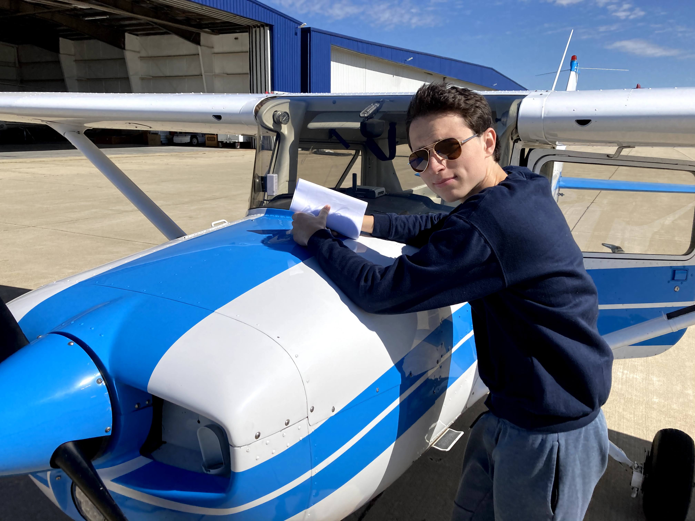
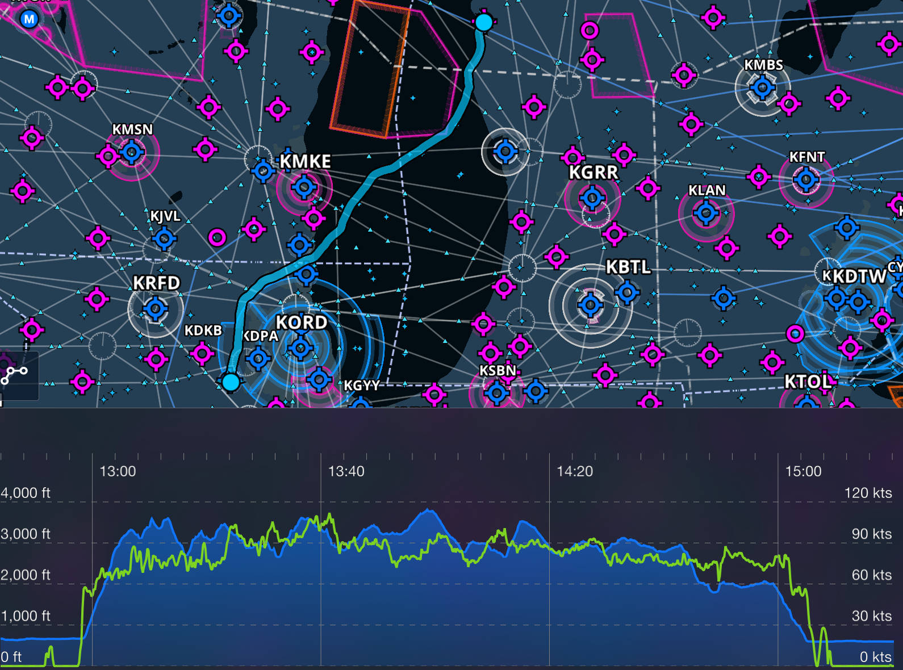
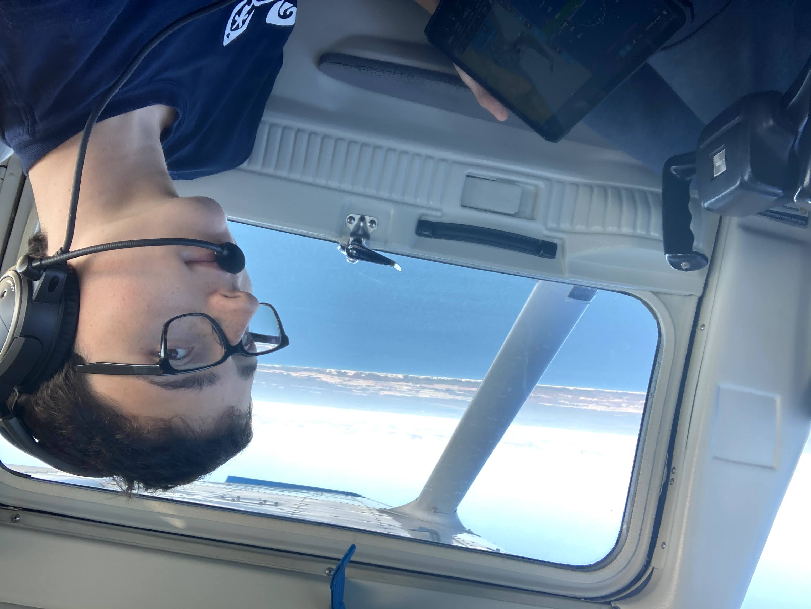
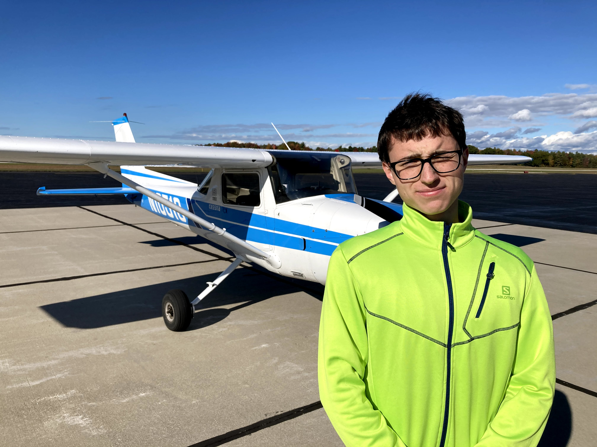
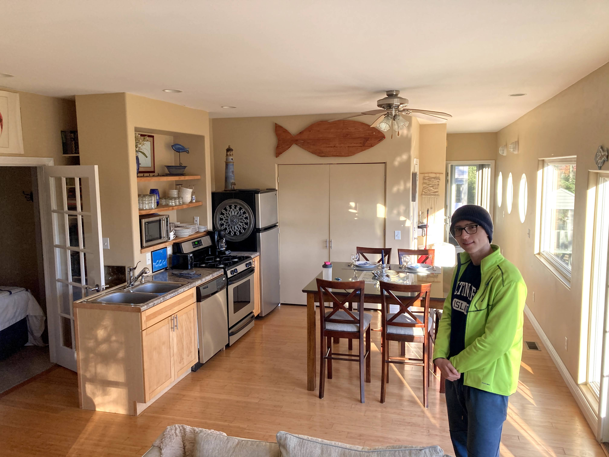
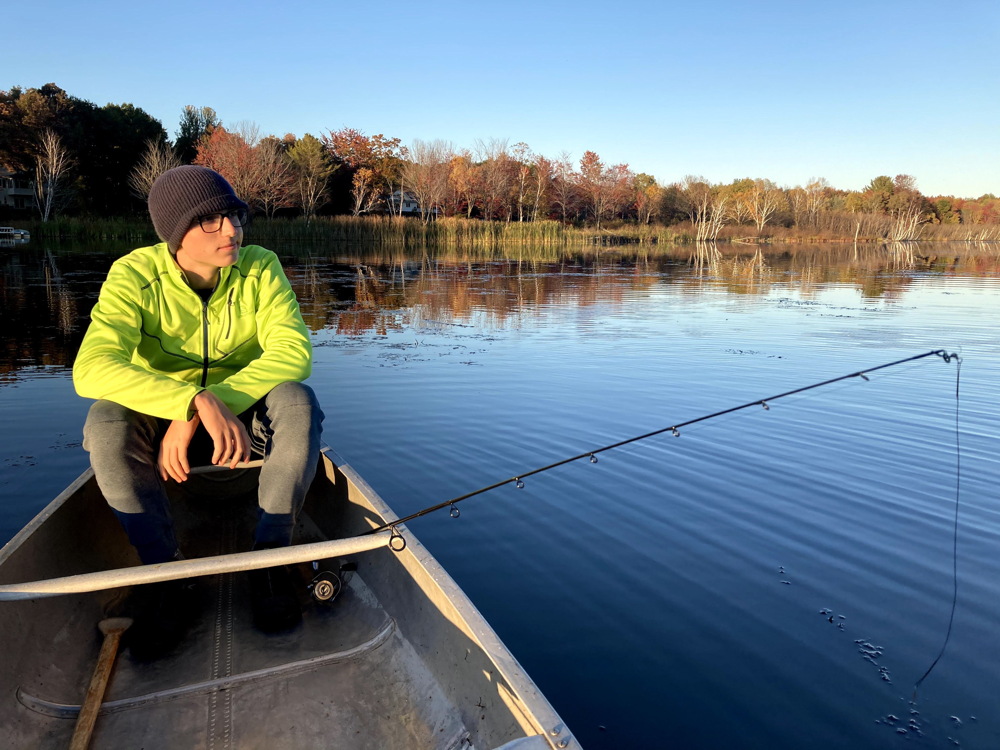
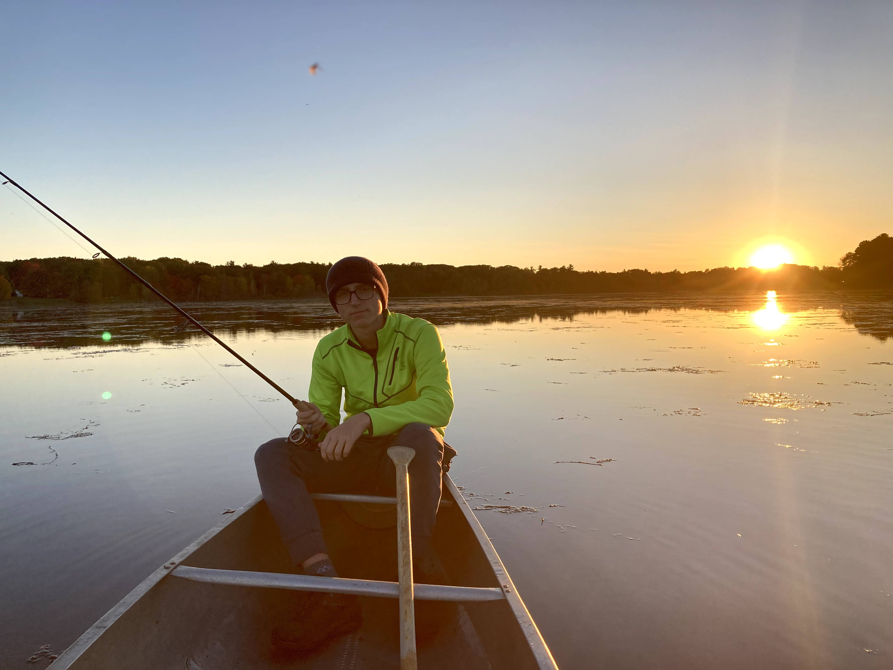
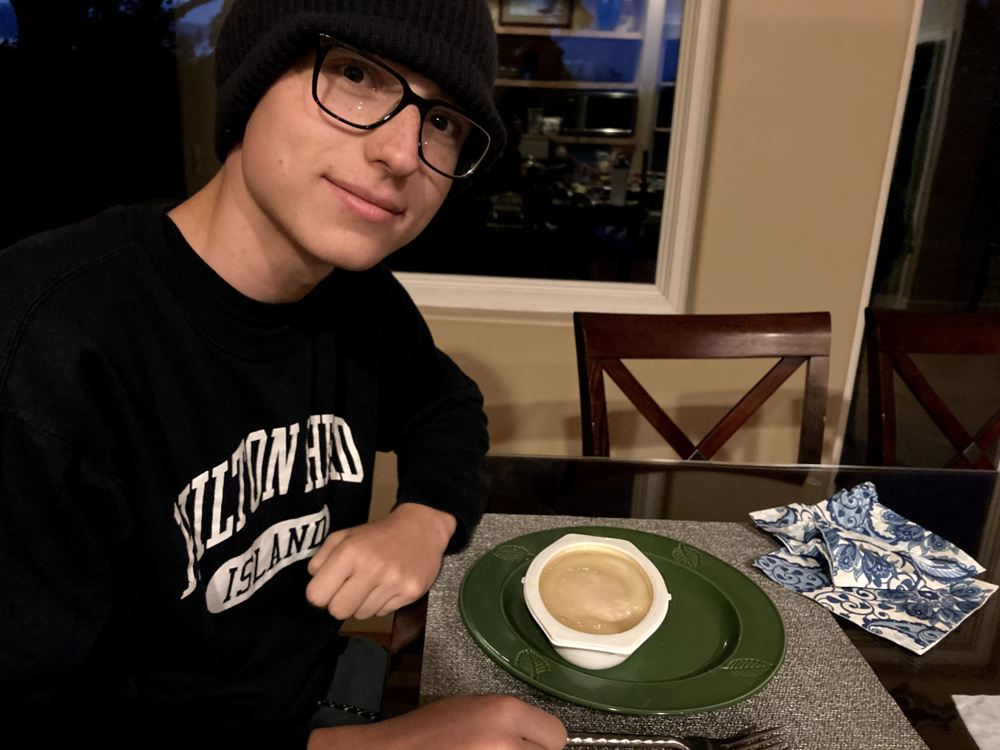
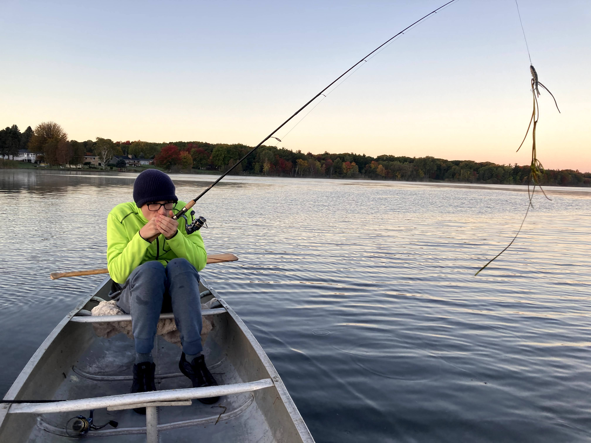
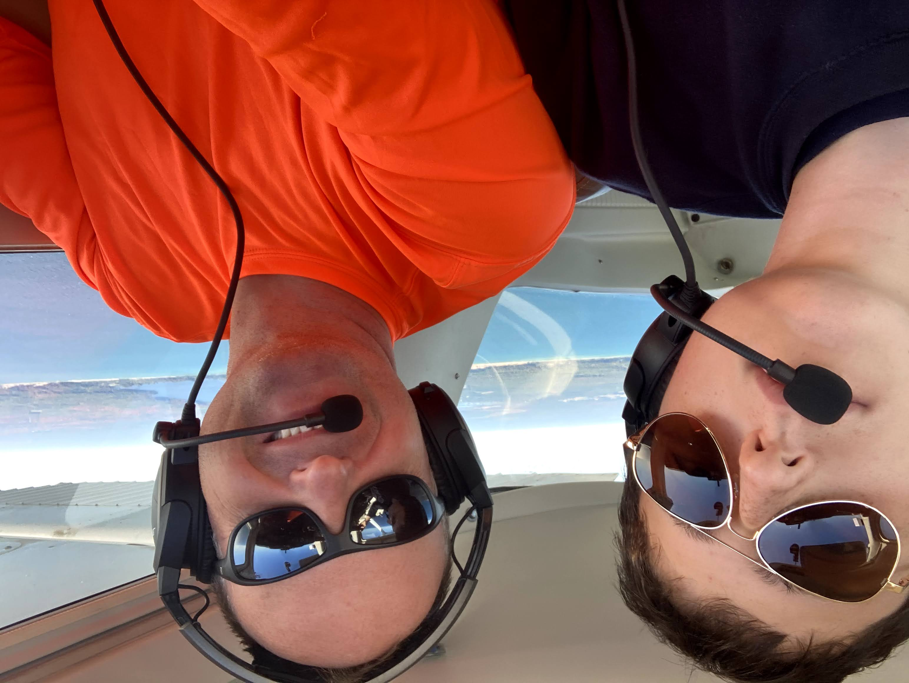

After exuberant spending spree on Amazon.com for fishing gear, on October 7th at 13:00 together with Milosh we took off from Aurora (KARR) to Ludignton (KLDM). We flew in a 1974 Cessna 150 "Commuter" featuring analog instruments, 22.5 gal tanks and a well-maintained 100 HP Lycoming engine. There was a newer (1976) plane available of the same type, however it had a lower useful-load which would put us near or above the limit. Thus, we opted for the older model and ended up 25 lbs below its max weight of 1600 lbs.

After requesting and obtaining the departure clearance from the Aurora ATC, we took off in the North-Easterly heading. The first hour was a little bumpy; I handed Milosh a pill of Dramamine to ease his upset stomach. Fortunately, once we reached Lake Michigan the bumps went away and we enjoyed a smooth ride, all the way to our destination. We cruised at a low-altitude of 3500 MSL admiring sandy dunes and witnessing first-hand significant destruction of the water-beaten Michigan shoreline.

When we landed at Ludington, we were welcomed by a 10°C drop in temperature and a very friendly airport employee who helped us with towing, refueling and tying down the plane. We quickly changed from shorts to long pants, then dag out hats and jackets from one of the bags.

Another surprise: no Uber in Ludington! We went to a near-by Wendy's to grab a snack while making taxi arrangements. We called the first taxi service from the GMaps-provided local business directory. Unfortunately the person informed us that their (only) cab is unavailable for at least another hour. Next listing in the directory - Judy's Rides - proved a success. A lady cab driver (presumably Judy) pulled within 10 minutes and we were off to our AirBnB house located at the Lincoln Lake.

Anxious to catch a fish, we jumped onto a canoe and off we went to the lake. It was getting cold.

The sunset at the Lincoln Lake

After two hours on the lake and no success in catching anything, we decided it's time to head home for a sleepover. We microwaved an awful meal posing as "chicken in mashed potatoes".

It was time to go to bed. When we woke up around 06:00 we heard shotgun shots. I suppose Michigan is a destination for bird hunters too. The morning at the lake was cold and we counted down minutes to the sunrise.

After two days of fishing and eating microwave-meals we decided it was time to head back home. On this leg, Milosh took the controls to practice stick-and-rudder skills.

I cannot wait to another fishing trip, this time probably down South where it's a little warmer.