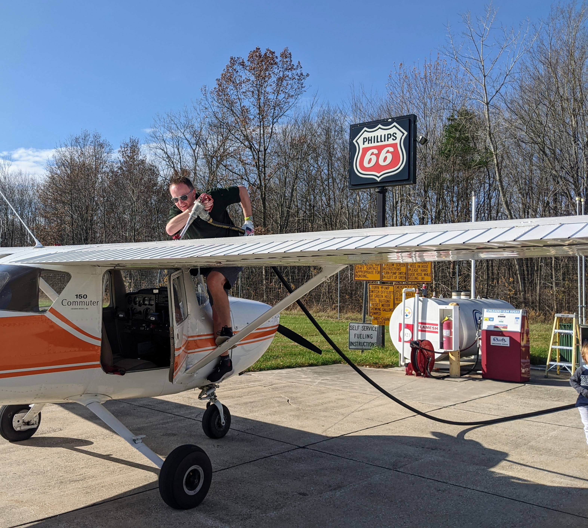

After dropping off a family member at the Michigan City airport (KMGC) and refueling, I left directly for my home airport, Aurora, IL (KARR). En route, I used the radio numerous times including during my transition through the Gary/Chicago airspace.

Shortly after the transition, I set the receiver to obtain the current weather from Aurora. It was around noon, the winds were gaining in strength, now gusting 21 knots.
With the weather, I contacted the Aurora Tower and got instructions to enter left downwind for runway 15. It was a busy time at the Aurora airport; the controller was working several approaches and departures.
While in the traffic pattern, I decided to increase the volume of my radio receiver a notch. A sudden gust of wind shook the plane and my hand bumped into an object on the console; my radio went mute.
I double-checked both the frequency setting and the volume knob while repeatably calling: _"ATC radio check"_. No response.
By then my plane was already parallel to the runway threshold. I made a decision: squawk 7600 if I don't restore the radio contact with the tower in the next five seconds. Luckily I glanced above the radio and spotted the culprit: in this 1976 Cessna 150 Commuter, there is a toggle to switch the radio between the cabin "SPEAKER" and the "HEADSET" -- it was set to "SPEAKER".
As soon as I toggled it back to "HEADSET", a familiar background hiss and the ATC's voice came through: _"four-uniform-whiskey, extend your downwind to make room for a departing learjet."_ The controller did not appear at all aware of my radio incident.

While the receiver volume was at a suboptimal level, it was still usable. In an effort to improve a working radio I created a much worse situation.

> **In critical times, unless absolutely required, do not touch the console.**

