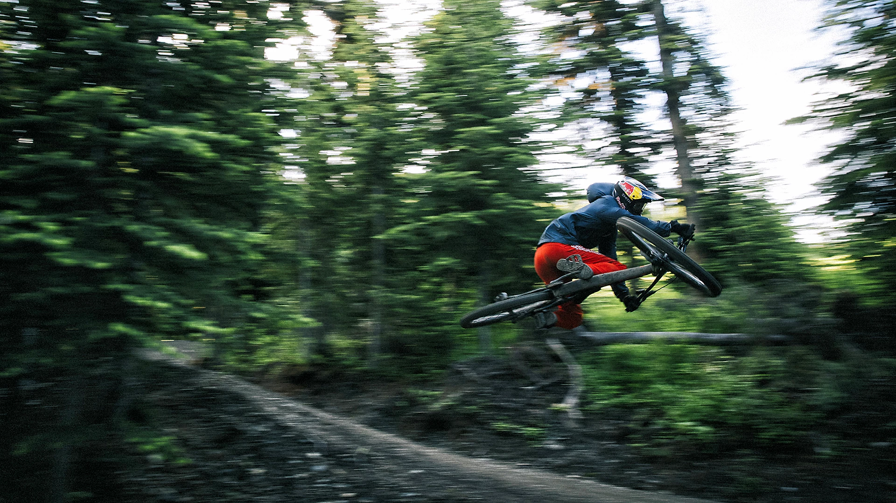
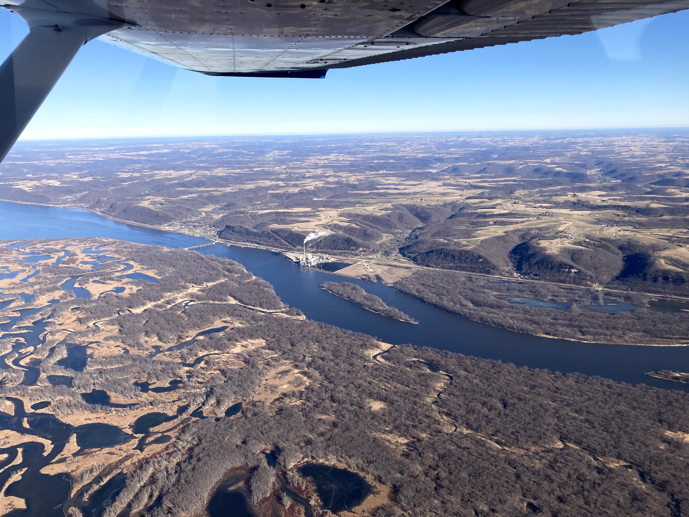
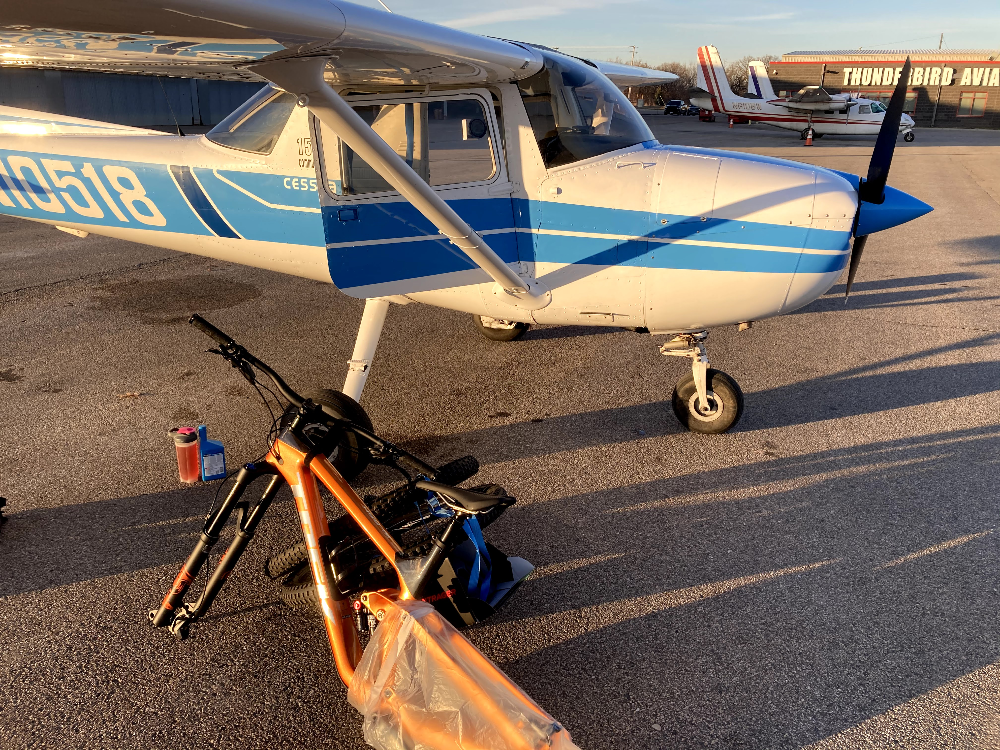
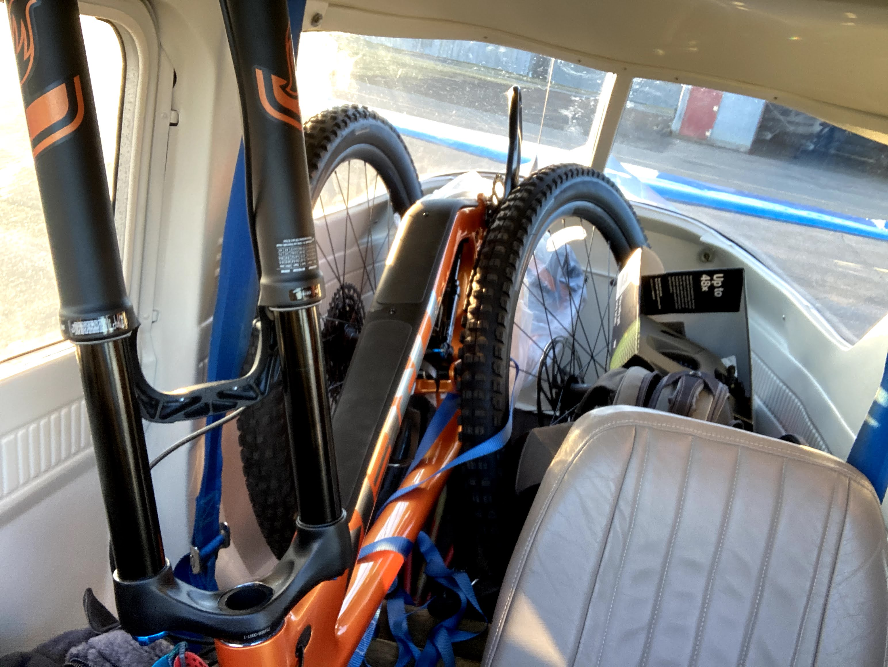
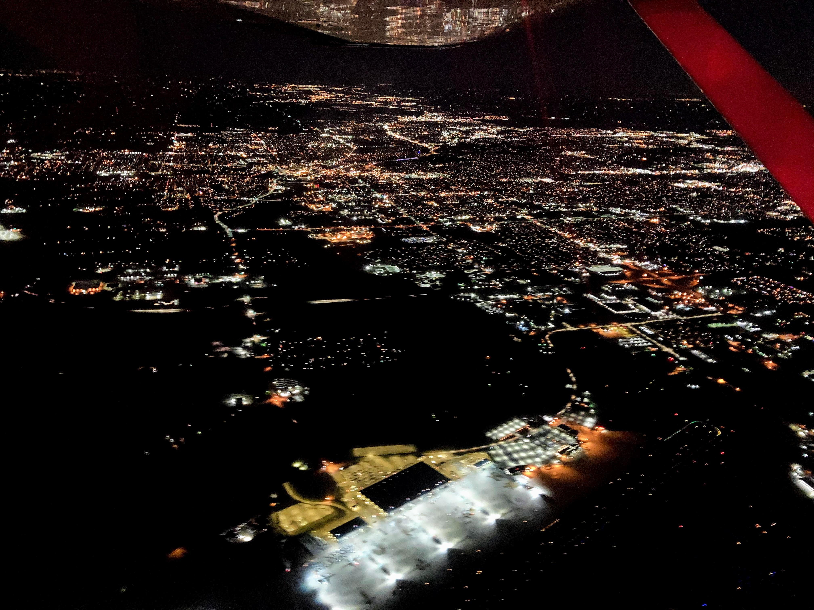

In the midst of the COVID-19 pandemic, mountain bikes would become difficult to find. Ironically, this is when I decided to get one. After days of research I opted for the **2021 Trek Slash**. I called local stores but the estimated wait times for delivery were eight months. 

Every day for the next two weeks I was checking country-wide availability of that bike. Eventually one showed up in a bicycle store _Freewheel Bike_, Minnetonka, Minnesota. I reached out and reserved one with a deposit.

After taking measurements I concluded the bike should fit through the door of a Cessna 150 I planned to rent. Delayed by a few days of bad weather, I finally took off on December 1st to _Flying Cloud Airport_ (FCM) from where I'd take Uber directly to the bicycle store.

On my way to Minnesota, the views of the Wisconsin River were spectacular.

After picking up the bike from the store, a Toyota Prius (Uber) took me right back to the airport. I disassembled the bike and started working my way to cram everything in.

After securing the cargo with straps, I departed for Chicago around 5pm. A good portion of the return trip was at night, with the city lights flickering below me.

So far, I'm having an absolute blast riding the Trek while still adjusting to a full-suspension bike. Many thanks to the friendly staff at the _Freewheel Bike_ store for working around my schedule and prompt replies to my emails. 