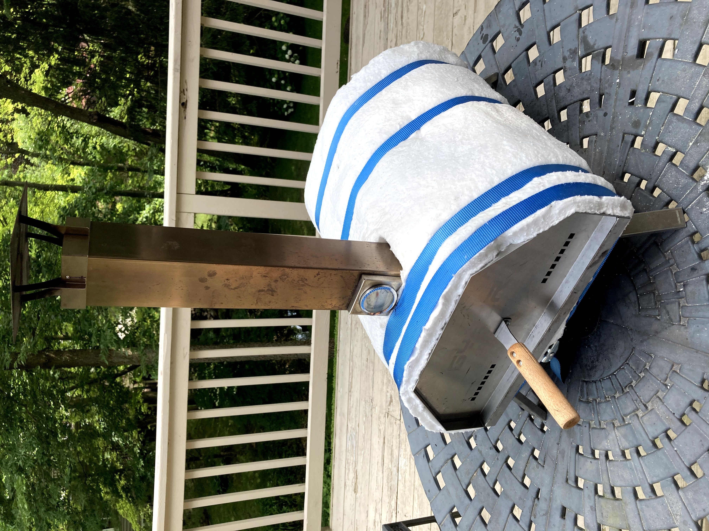
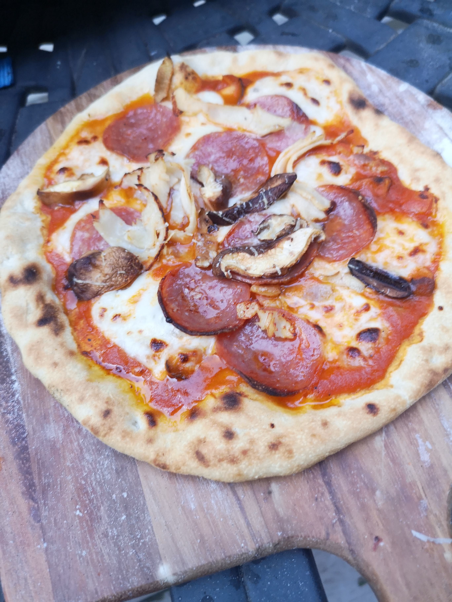
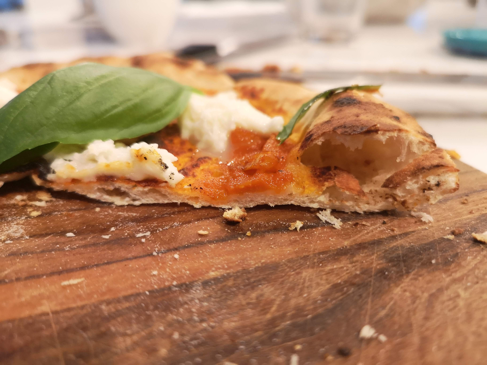

If you enjoy making your own Neapolitan pizza, you are probably fixated on obtaining the recommended 700°F or higher temperatures out of your pizza oven. A temperature this high will result in a crispy crust and a soft dough inside. For such reasons the best pizza ovens are heavy, large, made of bricks or stones and are wood fired. This construction will produce consistent, high temperatures.

Recently, a new group of ovens are becoming popular among amateur pizza makers. Units like Pyre or Ooni are characterized by a lightweight stainless steel construction, fired with wooden pellets or gas. Their biggest drawbacks are: hard to obtain a desired temperature and keeping the temperature stable. The vendor recommends that you be adding small amounts of the fire material in order to keep the flames consistent. This task puts significant overhead on the pizza-maker, who is also preparing the pizzas.

Here, I'll share two tips that addressed the shortcomings of my stainless steel oven.

If you recall your chemistry classes, obtaining hot fire requires lots of oxygen and pizza oven is no exception. On a windy day, you can try positioning the back of the oven into the wind but what if the weather does not cooperate? On a calm day or if the winds are unpredictable, place a large electric fan directly behind the oven. The fan will blow the air at a constant rate which will result in an excellent flame control.

With plenty of oxygen, our mini-oven will reach the desired temperature quickly. Unfortunately, we may run into a second problem: keeping the high temperature for an extended time. In a matter of minutes we may reach 1000°F and only a minute later see it drop by hundreds of degrees. This is bad because in order to achieve consistent results, we need a stable temperature. While nothing compares to a brick oven, we can still achieve most of the effect by wrapping our stainless steel oven in a heat-resistant ceramic fiber blanket such as the 1"-thick Kaowool or CeraBlanket, both rated for 2300°F. No doubt the oven will loose some of its original charm, and rise eyebrows among friends, but it will help the oven retain the high temperature for much longer so we can focus on preparing the pizzas. As a bonus, the insulation will protect against accidentally touching the incredibly hot surfaces of a stainless steel oven.

I wish you all delicious Neapolitan pizzas!

